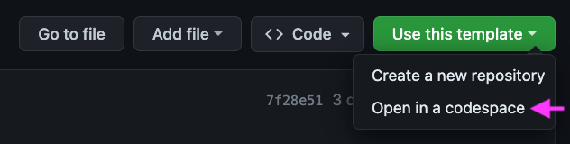
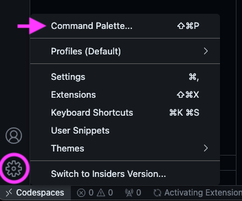

# smartPyDC

This purpose of this repo is to allow you to set up a working smartpy environment with as little fuss as possible.

## Create a codespace

1. Create an account at github.com
2. Navigate to https://github.com/grum-tez/smartPyDC
3. Click _Use this template_, then click _Open in a codespace_.

This will clone a copy of the template repository to a remote server (a 'codespace'). When the codespace is created, an in-browser version of Visual Studio Code will provide you access to the repository.

Your codespace should now be up and running. Everything you need to complete the tutorial, including smartpy, is pre-installed.

## Visual Studio Code
If you are new to Visual Studio Code, here are a few shortcuts and hints to help you to orient yourself

### The Command Palette
The Command Palette is a searchable menu that provides access to many commands in VS Code. To open it, click the gear icon in the bottom left hand corner of the screen and select *Command Palette*.

You will use the Command Palette often enough that it is well worth learning the keyboard shortcut!

**Command Palette keyboard shortcuts:**
Windows/Linux: Ctrl + Shift + P
macOS: ⇧⌘P

Try it out - search for "View: Toggle Terminal" in the command palette. Notice that the keyboard shortcut for *Toggle Terminal* appears alongside the command.

**Toggle Terminal keyboard shortcuts:**
Windows/Linux: Ctrl + \`
macOS: ^\` (control + backtick)

This is another shortcut worth remembering!

### The .devcontainer folder

You will notice your workspace contains a single folder called ".devcontainer".

 This contains configuration files which allow the repo to run in a "Development Container". This keeps the development environment constant across systems. This will helpful in the future for sharing and communicating with others. The devcontainer allows you to share your repo and the development environment you are working in. This means your code will work more consistently across machines, and it will be easier for others to reproduce the bugs when you need help. For now, just leave the files in the .devcontainer folder alone.

### How to use Codespaces with your local version of VSCode

If you are familiar with VSCode and wish to use your natively-installed VSCode instead of an in-browser instance, open the command palette and select "Codespaces: Open in VS Code Desktop". 

On the other hand, if you are happy to work in the browser or don't want to install VSCode, you can safely skip this.

### How to connect to your own fork of the tutorial repository

If you are familiar with using git and would like to add and commit your changes to a github repository, follow the instructions below. You can complete the Smartypy tutorial without doing this - however be aware that by default your work in the codespace will be automatically deleted after 30 days of inactivity. 

In the Activity Bar, click the Source Control view.

To stage your changes, click the + symbol on the line next to the word changes (it appears when you mouseover the word *changes*)

To commit your staged changes, type a commit message describing the change you've made, then click Commit.

Click Publish Branch.

In the "Repository Name" dropdown, type a name for your new repository, then select Publish to GitHub private repository or Publish to GitHub public repository.

## Next steps

You can now choose to either complete the tutorials with a remote setup (via a codespaces server) or a local devcontainer setup (on your own computer).

**Remote Option**: Skip the rest of this readme and complete the tutorials in your new codespace, using the in-browser Visual Studio Code
**Local Option**: Create your own fork of the repo and complete the tutorials in your local instance of Visual Studio Code

We recommend the **Remote Option** if:

- you want to start learning SmartPy *right now* and save 10-20 minutes
- you don't mind if your work is automatically deleted if inactive for 30 days
- you don't want to install prerequisites on your machine (i.e docker, vscode)
- you can't spare 2 gb of hard drive space.
- you don't have an especially powerful machine. This might mean the experience on codespaces will similar (or even better) than your local machine.

We recommend the **Local Option** if:

- you want to _learn_ in the same environment in which you will _build_
- you plan to transition directly from learning SmartPy to building with it
- you don't want to be dependent on codespaces
- you want to save your free codespaces hours for other uses (you have 60 free hours per month)
- you've got a powerful machine and want the smoothest possible user experience.

To choose the **Remote Option**: Close this readme and move onto the first exercise of the tutorials.

To choose the **Local Option**, simply continue to follow along:

## Local Option

### Prerequisites

- Install [Docker Desktop](https://www.docker.com/products/docker-desktop/). If you are on 2021 or later Apple machine, you may have to select the "apple chip" download option. 
Make sure Docker is installed *and running*. If you restart your machine, you may have to remember to reopen it.

- Install [Visual Studio Code](https://code.visualstudio.com/download). Make sure you are logged in with your github credentials. You can check by clicking on the icon of the portrait on the bottom left of the vscode window.

- Install the Visual Studio Code "Dev Containers" extension 

### Clone your repo into a local volume.

First, complete the earlier section titled **Optional: Connect to your own fork of the tutorial repository** (if you haven't already done so). Alternatively you can create your own fork of the repository with the github interface.

Open the command palette and select "Clone Repository in Container Volume..."

Select "Clone a repository from GitHub in a Container Volume..."

Select your fork of the smartPyDC repository.

The prompt will ask you to choose a branch. Select "main".

A VSCode window will open in a local container volume. This volume will persist, even if you turn off your computer, unless you delete the container using docker. However, notice that the vscode environment is already connected to your github repository.

For example, if you enter `git remote -v` into the terminal, you will see the address of your fork of the repository. This means you can add, commit and push your work as though you were working from a local repository without any further setup (which we recommend you do).

### Troubleshooting

If your devcontainer volume in VSCode won't open, reopen Docker Desktop and try again.
